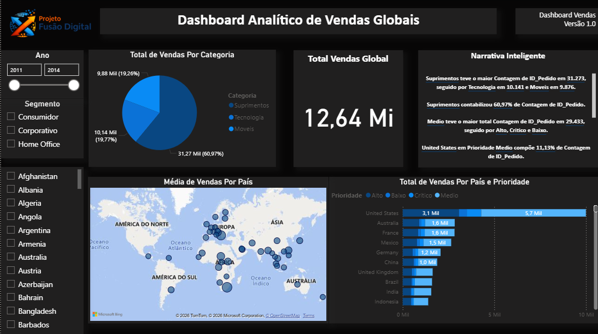

# Projeto Fusão Digital – Arquitetura e Engenharia de Dados & BI

## 📌 Contexto
Com a fusão entre duas empresas que operavam em infraestruturas distintas (on-premise e cloud), surgiu a necessidade de integrar os dados de vendas em uma base centralizada, confiável e padronizada, viabilizando análises consolidadas e suporte à tomada de decisão estratégica.

---

## 🎯 Objetivo
Integrar, tratar e disponibilizar dados de vendas de duas empresas por meio de uma pipeline automatizada, possibilitando a criação de dashboards unificados para as áreas comercial e executiva.

---

## 🗂️ Fonte dos Dados
- Dados de vendas de duas empresas distintas  
- Origem: SQL Server (on-premise) e PostgreSQL (AWS RDS)  
- Dados integrados, tratados e padronizados em ambiente cloud  

---

## 📚 Documentação do Projeto
A documentação detalhada do projeto está disponível nos arquivos abaixo:

- [01 – Contexto do Desafio](docs/01-contexto-do-desafio.md)
- [02 – Arquitetura da Solução](docs/02-arquitetura-da-solucao.md)
- [03 – Modelagem de Dados](docs/03-modelagem-de-dados.md)
- [04 – Desenvolvimento da Pipeline](docs/04-desenvolvimento.md)
- [05 – Streaming e Processamento](docs/05-processamento-com-spark.md)
- [06 – Implantação e Execução](docs/06-implantacao-e-execucao.md)

---

## 🔧 Arquitetura e Desenvolvimento
- Pipeline de dados automatizada utilizando **Apache Airflow**
- Execução em ambiente **Docker Compose**
- Processos de ETL organizados em camadas **Bronze, Silver e Gold**
- Exportação dos dados tratados para consumo analítico

---

## 🔁 ELT com Python e Docker

O projeto utiliza uma abordagem de **ELT (Extract, Load, Transform)**, na qual os dados são inicialmente extraídos e carregados, e posteriormente transformados utilizando scripts em Python.

### Etapas do ELT
- **Extract:** leitura dos dados de vendas das fontes de origem
- **Load:** persistência dos dados brutos na camada *Raw*
- **Transform:** aplicação de regras de negócio e geração dos dados tratados nas camadas *Processed / Analytics*

Os processos são executados em ambiente containerizado com **Docker Compose**, garantindo padronização e reprodutibilidade do ambiente.

### Integração com Airflow
O Apache Airflow é responsável por orquestrar as etapas do ELT, controlando dependências, agendamento e monitoramento da pipeline.

## 📊 Análise e Visualização
- Modelagem dos dados voltada para análise
- Criação de métricas e KPIs de vendas
- Desenvolvimento de dashboards interativos no **Power BI**

---

## 💡 Principais Insights
- Visão consolidada de vendas pós-fusão
- Eliminação de inconsistências entre bases de dados
- Apoio à tomada de decisão com dados centralizados e confiáveis

---

## 🚀 Próximos Passos
- Evolução do monitoramento com ferramentas como **Grafana**
- Implementação de versionamento de dados
- Inclusão de novas fontes e métricas analíticas

---

## 🧱 Arquitetura da Solução

## ⚙️ Orquestração com Apache Airflow

## 📊 Dashboard Power BI

