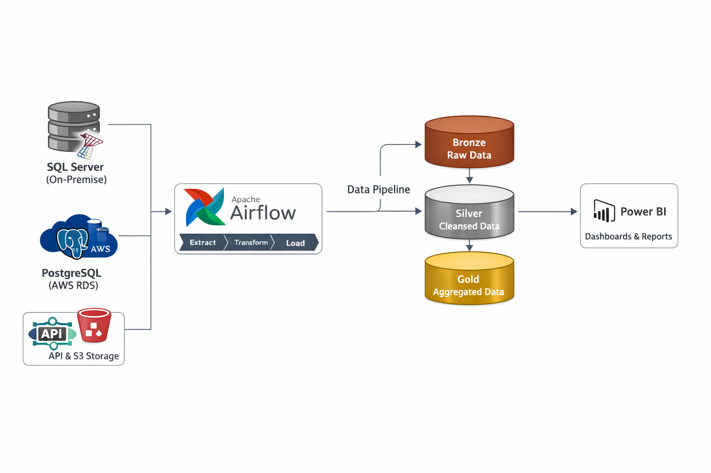
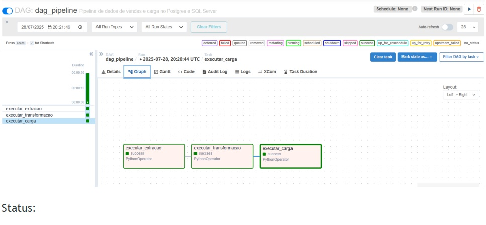

# Projeto Fusão Digital – Análise de Dados e BI

## 📌 Contexto
Com a fusão entre duas empresas que operavam em infraestruturas distintas (on-premise e cloud), surgiu a necessidade de integrar os dados de vendas em uma base centralizada, confiável e padronizada, permitindo análises consolidadas e suporte à tomada de decisão estratégica.

## 🎯 Objetivo
Integrar, tratar e disponibilizar dados de vendas das duas empresas por meio de uma pipeline automatizada, possibilitando a criação de dashboards unificados para as áreas comercial e executiva.

## 🗂️ Fonte dos Dados
- Dados de vendas de duas empresas distintas
- Origem: SQL Server (on-premise) e PostgreSQL (AWS RDS)
- Dados integrados e padronizados em ambiente cloud

## 🔧 Arquitetura e Desenvolvimento
- Pipeline de dados automatizada com Apache Airflow
- Execução em ambiente Docker Compose
- Processos de ETL organizados em camadas Bronze, Silver e Gold
- Exportação dos dados finais para consumo em ferramentas de BI

## 📊 Análise e Visualização
- Modelagem dos dados para análise
- Criação de métricas e KPIs de vendas
- Desenvolvimento de dashboards interativos no Power BI

## 💡 Principais Insights
- Visão consolidada de vendas pós-fusão
- Eliminação de divergências entre bases
- Apoio à tomada de decisão com dados centralizados

## 🚀 Próximos Passos
- Evolução do monitoramento com ferramentas como Grafana
- Versionamento de dados
- Inclusão de novas fontes e métricas analíticas

## 🧱 Arquitetura da Solução

## ⚙️ Orquestração com Apache Airflow

## 📊 Dashboard Power BI

